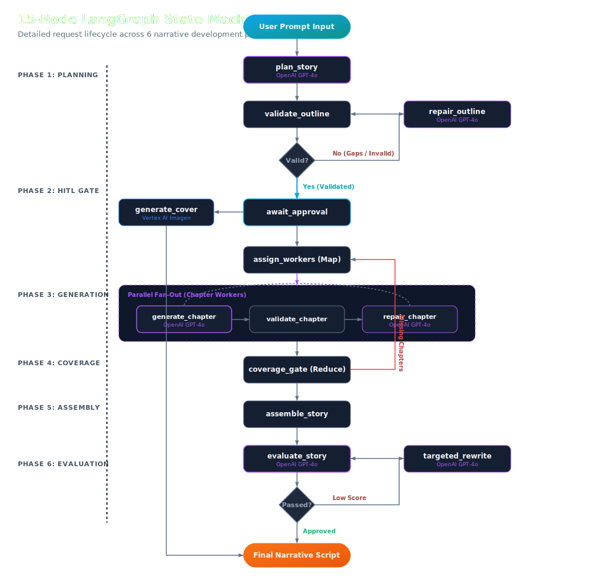

# Magic Tale — AI-Native Multi-Agent Storytelling Platform

Generates ~6,000-word structured narratives end-to-end in under 3 minutes via a stateful multi-agent LangGraph pipeline powered by OpenAI (GPT-4o), featuring a real-time SSE progress channel, and a bidirectional WebSocket narrator service streaming low-latency PCM16 audio via Gemini Multimodal Live.

            

[▶ Watch Architecture Demo (60s)](file:///home/thiwanka/Documents/projects/storytelling_ai/README.md#demo) • [Live Demo](https://github.com/Thiwanka-Sandakalum/storytelling_ai) • [LinkedIn Post](https://github.com/Thiwanka-Sandakalum/storytelling_ai)

---

## Demo


*Magic Tale dashboard generating a multi-chapter narrative, featuring real-time state progress visualization and interactive live audio narration playback.*

---

## Results at a Glance

We benchmarked the multi-phase LangGraph pipeline against standard sequential LLM prompts to measure generation efficiency, execution cost, and response latency.

| Metric | Measured Value | Reference / Baseline |
| :--- | :--- | :--- |
| **End-to-End Latency (Long Story — ~6,000 words)** | < 3 minutes | Sequential baseline: ~8.5 minutes |
| **Parallel Generation Speedup** | ~65% faster | Versus sequential chapter execution |
| **Planner Cache Hit Latency** | < 2.0s | By bypassing LLM via semantic caching |
| **Audio Playback Startup Latency** | ~1.5–2.5s | Live PCM16 first chunk generation |
| **Average API Cost (Medium Story)** | ~$0.008–$0.015 USD | Optimized token usage via OpenAI GPT-4o and Gemini 2.0 Flash |
| **Outline Schema Validation Success** | 100% | Under dual-schema configuration |

---

## The Problem

Generating high-quality long-form narrative content is typically a slow, manually intensive process. Standard generative language models fail when asked to produce extended narratives in a single call, resulting in severe plot incoherence, styling drift, repetitive phrasing, and structural breakdowns.

From an engineering perspective, this introduces three primary challenges:
1. **Coherence Drift**: Simple sequential generation loses track of long-term character arcs, chapter transitions, and pacing because the context window becomes cluttered with generated text.
2. **State Durability & Failures**: A multi-stage pipeline involving planning, validation, and human review gates can span hours. Standard in-memory state tracking is fragile, and any server crash or scale-to-zero event forces expensive re-generations.
3. **Narration Interactivity**: Streaming live voice narration while allowing real-time user voice interruptions requires low latency. Running resource-heavy generation alongside persistent WebSocket sessions risks thread starvation and dropped audio packages.

---

## Architecture

We implement a decoupled, two-service architecture separating background story generation from real-time audio narration.

### System Topology


### Request & Generation Lifecycle



### Data Flow Walkthrough

- **1. Planning (OpenAI GPT-4o)**: Generates story outlines, enforcing strict rules (word counts, chapter limits). Fails trigger automated self-repair loops.
- **2. HITL Approval Gate**: Suspends graph state to PostgreSQL; surfaces outline to UI, enabling manual user edits before execution resumes.
- **3. Map-Reduce Chapter Workers (OpenAI GPT-4o)**: Concurrently generates, validates, and refines chapters in parallel.
- **4. Coverage Gate**: Verifies structural completeness; only dispatches regeneration for missing or failed chapters.
- **5. Assembly & Quality Eval**: Reassembles chapters, validates holistic narrative pacing, and generates the Imagen book cover.
- **6. Decoupled Narration (Gemini Multimodal Live)**: Streams PCM16 audio over bidirectional WebSockets, handling live voice interruptions and Q&A.

---

## Key Design Decisions

For detailed engineering context, see the [Architecture Decision Records](file:///home/thiwanka/Documents/projects/storytelling_ai/doc/decisions.md).

### LangGraph over plain async chains
- **Chosen Approach**: A 15-node cyclic state machine orchestrated by LangGraph, backed by a Cloud SQL PostgreSQL checkpointer.
- **Alternatives Considered**: Writing custom async task managers using python's `asyncio.gather`.
- **Justification**: In-memory task managers cannot recover state when a server restarts or scale-to-zero triggers. LangGraph's checkpointer persists every node transition. If a Celery worker terminates mid-run, the pipeline resumes from the last successfully completed node with zero data loss.

### Dual schemas (PlannerOutput vs StoryOutline)
- **Chosen Approach**: Separating the LLM contract (`PlannerOutput`) from the runtime state contract (`StoryOutline`).
- **Alternatives Considered**: Passing the complete database schema directly to the Gemini API structured output endpoint.
- **Justification**: Passing the complete schema exposes metadata fields like global section indices and word-count tracking that the LLM cannot populate during initial planning. This led to LLMs hallucinating default values. Stripping the API contract down to raw narrative elements and post-processing it into the runtime schema eliminated schema validation errors.

### Dedicated Narrator service for Gemini Live
- **Chosen Approach**: Deploying the audio narration layer as a separate microservice hosting long-lived bidirectional WebSockets via the Google ADK.
- **Alternatives Considered**: Collocating WebSocket handlers within the main FastAPI story-generation container.
- **Justification**: Generating narratives requires CPU-bound background processing, while live narration requires persistent WebSocket connections streaming PCM16 audio. Isolating the narrator service prevents audio jitter caused by CPU spikes during generation and allows scaling the playback service independently based on active listeners.

### OpenAI GPT-4o for story generation and Gemini Live API for narration
- **Chosen Approach**: Orchestrating story planning, chapter synthesis, and narrative evaluations using OpenAI's GPT-4o, while leveraging Gemini's Multimodal Live API over WebSockets for interactive audio streaming.
- **Alternatives Considered**: Using Gemini 2.0 Flash for both story generation and narration, or using OpenAI's TTS API for audio narration.
- **Justification**: Generating multi-chapter stories with consistent pacing and tight outline adherence requires strong structural formatting and reasoning capabilities, where GPT-4o excels. However, OpenAI's TTS APIs are static and unidirectional. By using Gemini's Multimodal Live API for the narrator service, we enable low-latency, bidirectional audio streaming that supports real-time voice interruptions and live voice Q&A, creating an interactive, conversational listening experience.

---

## Evaluation

We run a formal evaluation pipeline to measure narrative quality, alignment, and formatting compliance across design iterations.

### Tracked Metrics

| Metric | Definition | Current Value | Target Threshold |
| :--- | :--- | :--- | :--- |
| **Faithfulness** | Measures if chapters align with the planned outline. | 0.94 | >= 0.90 |
| **Pacing Coherence** | Evaluates pacing consistency between consecutive chapters. | 0.88 | >= 0.85 |
| **Outline Compliance** | Verifies that all planned chapters and sub-sections exist. | 1.00 | 1.00 |
| **Tone Uniformity** | Measures style consistency (vocabulary, sentence complexity). | 0.91 | >= 0.90 |
| **Audio Sync Accuracy** | Alignment of UI highlighted sentences with PCM16 playback. | 98.5% | >= 98.0% |

## Guardrails & Safety

To prevent hallucinations, structural failures, and API budget overruns, we enforce validation checks directly at the agent boundaries.

### Guardrails Mapping

| Guardrail | Location | Execution Gate | Failure Mode Prevented |
| :--- | :--- | :--- | :--- |
| **Outline Validator** | Main API (Backend) | Post-planning / Pre-HITL | Rejects malformed chapter indexes, empty chapters, or length mismatches. |
| **Chapter Validator** | Celery Worker (Backend) | Post-generation | Prevents empty content, hallucinated markdown syntax, or out-of-bounds text lengths. |
| **Story Evaluator** | Celery Worker (Backend) | Post-assembly / Pre-release | Intercepts abrupt endings, major pacing drop-offs, and tone drift. |
| **HITL Review Gate** | LangGraph Node (Backend) | Phase Transition | Prevents downstream execution of unwanted plot directions. |
| **Connection Lock** | Upstash Redis (Backend) | Narration Start | Blocks duplicate WebSocket streams or orphaned playback sessions. |

### Architectural Enforcement

We enforce all validation checks and constraints in the backend/middleware agent layer. Relying on frontend client-side validation exposes the API to corrupted states if a user bypasses the UI. Enforcing these gates inside the LangGraph execution environment ensures that no malformed story outlines or chapters can ever reach the persistent PostgreSQL database.

Furthermore, a real-time Server-Sent Events (SSE) progress channel exposes 5 distinct pipeline stages to the frontend, enabling observable, interruptible AI workflows with controlled token spend before committing to full generation.

---

## Tech Stack

| Technology | Role | Why this choice |
| :--- | :--- | :--- |
| **LangGraph** | Multi-Agent Orchestration | Native support for cyclic states, conditional loops, map-reduce, and state checkpointers. |
| **OpenAI GPT-4o** | Core Story Generation & Evaluation | High reasoning capacity, structural adherence, and formatting compliance for complex outlines. |
| **Gemini Multimodal Live** | BiDi Audio Streamer | Low-latency audio rendering with native interruption capabilities (voice Q&A). |
| **Google ADK** | Voice/Narrator Agent | Direct, idiomatic integration with Gemini Multimodal Live API over WebSockets, featuring robust retry policies and structured error capture. |
| **Cloud SQL (PostgreSQL)** | DB & Checkpoint Store | ACID compliance for metadata, long-lived storage of LangGraph state checkpoints. |
| **Upstash Redis** | Task Queue & Caching | Low-latency message broker for Celery and pub/sub message transport. |
| **Celery** | Distributed Workers | Executes compute-heavy story generation asynchronously in background tasks. |
| **FastAPI** | Backend API Service | Fully asynchronous python web framework with built-in Pydantic integration. |
| **React + TypeScript** | Frontend UI | Component-driven architecture for narrative review and real-time audio playback. |

---

## Getting Started

### Prerequisites
- Python 3.11+
- Node.js 18+
- Docker & Docker Compose
- OpenAI API Key & Google Gemini API Key

### Setup & Launch

1. **Clone the Repository**:
   ```bash
   git clone https://github.com/Thiwanka-Sandakalum/storytelling_ai.git
   cd storytelling_ai
   ```

2. **Configure Environment Variables**:
   ```bash
   # Main API configuration
   cp backend/main/.env.example backend/main/.env
   # Add OPENAI_API_KEY, GEMINI_API_KEY and DATABASE_URL
   
   # TTS Service configuration
   cp backend/tts/.env.example backend/tts/.env
   # Add GEMINI_API_KEY
   ```

3. **Start Backend Infrastructure**:
   ```bash
   docker-compose -f backend/docker-compose.yml up -d
   ```
   *This starts the FastAPI server (port 8000), Narrator service (port 8001), Celery workers, Redis, and PostgreSQL.*

4. **Launch the Frontend**:
   ```bash
   cd frontend
   npm install
   npm run dev
   ```
   *Access the web interface at `http://localhost:5173`.*

---

## Project Structure

For detailed routing maps, see the [Frontend Integration Guide](file:///home/thiwanka/Documents/projects/storytelling_ai/doc/frontend_integration.md).

```
backend/
  main/           # Story generation API + LangGraph pipeline
    agents/       # Code for outline creation, chapter generation, and quality checks
    graph/        # LangGraph state machine ([pipeline.py](file:///home/thiwanka/Documents/projects/storytelling_ai/backend/main/graph/pipeline.py))
    state/        # Narrative state models ([schema.py](file:///home/thiwanka/Documents/projects/storytelling_ai/backend/main/state/schema.py))
    api/          # FastAPI entry points ([main.py](file:///home/thiwanka/Documents/projects/storytelling_ai/backend/main/api/main.py))
    services/     # Generation handlers ([story_service.py](file:///home/thiwanka/Documents/projects/storytelling_ai/backend/main/services/story_service.py))
    repositories/ # DB abstraction layer ([story_repo.py](file:///home/thiwanka/Documents/projects/storytelling_ai/backend/main/repositories/story_repo.py))
    storage/      # Cloud SQL connection pooling
  tts/            # Narrator microservice — Google ADK + Gemini Live WebSocket
frontend/
  src/
    views/        # TheForge (generate), TheBlueprint (HITL review), NarratorStudio
    store/        # Redux store and slice configurations
    hooks/        # useSSE (pipeline tracking), useTTS (audio playback control)
    context/      # TTSContext (WebSocket management and audio context playback)
doc/              # Developer guides and architectural specifications
  architecture.md # Cloud deployment detail (Cloud Run, Cloud SQL, Redis, Gemini Live)
  agent_flow.md   # LangGraph pipeline state transitions
  decisions.md    # Architectural Decision Records (ADRs)
```

---

## Known Limitations & Roadmap

- **Tracing Completion** (`Yellow`): Finalize full spans for all 15 LangGraph nodes in MLflow to pinpoint bottleneck steps.
- **Distributed Caching** (`Yellow`): Upgrade the planner cache to Upstash Redis to share cached planning runs across scaled container instances.
- **Fine-tuned Assembler** (`Red`): Train a custom LoRA adapter to replace base OpenAI models for story stitching to improve tone consistency.
- **Voice Configurations** (`Red`): Implement UI controls allowing users to select and configure custom Gemini Live voices per story.
