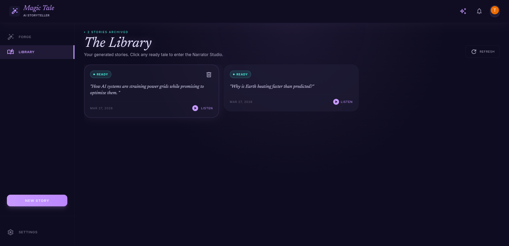
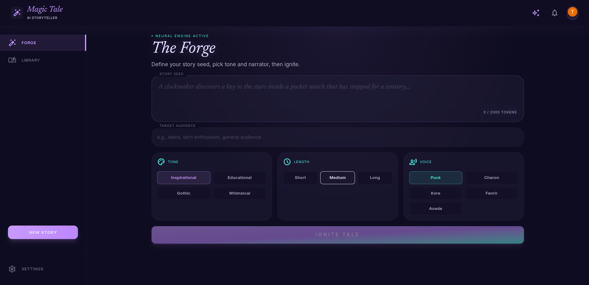
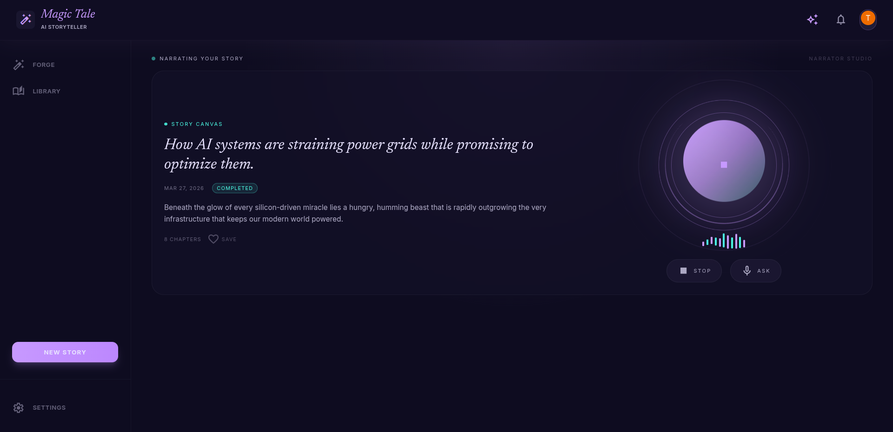

<<<<<<< HEAD
# Storytelling AI — LangGraph Multi-Phase Narrative Pipeline with Gemini Live Narration

> **15-node, 6-phase LangGraph state machine** that converts a one-line topic prompt into a validated long-form story — structured outline planning, multi-stage chapter validation + repair loops, Human-in-the-Loop approval, parallel fan-out generation, coverage gate, LLM quality evaluation, and a separate Google ADK narrator service that streams expressive PCM16 audio via Gemini Multimodal Live.

           

**[Architecture](doc/architecture.md) · [Agent Flow](doc/agent_flow.md) · [ADRs](doc/decisions.md)**

---

## The Problem

Generating a coherent long-form story with an LLM is not a single call — it requires a structured planning phase, per-chapter validation and repair loops, deterministic coverage checking, holistic quality evaluation, and a separate real-time audio delivery layer. Existing demos do one of these. This project integrates all of them with human oversight gates, durable checkpointing, and production-grade reliability.

## The Solution

A two-service distributed system: a **15-node LangGraph state machine across 6 phases** orchestrates the full story lifecycle (plan → validate → HITL → parallel generate+validate+repair → coverage gate → assemble → quality evaluate), deployed as an on-demand Celery worker. A **Google ADK narrator service** manages live Gemini BiDi audio sessions over WebSocket with per-paragraph segment sync and real-time voice Q&A.

---

## Demo


---

## System Architecture


Two services deploy independently on **Cloud Run (scale-to-zero)**. Generation jobs are dispatched asynchronously via Celery; the narrator service holds long-lived Gemini Live WebSocket sessions independently.

| Managed Service | Role |
|---|---|
| **Cloud SQL PostgreSQL** | Story metadata, job status, LangGraph checkpoint store |
| **Cloud Storage** | Final scripts (.txt), audio chunk files |
| **Upstash Redis** | Celery task queue, SSE progress pub/sub, narrator session state, script pre-warm cache |
| **Gemini Live** | BiDi PCM16 audio stream — narration + real-time voice interruption |

---

## Pipeline Architecture


| Phase | Nodes | Purpose |
|---|---|---|
| **1 — Planning & Validation** | `plan_story` → `validate_outline` → `repair_outline` | Generate outline with Gemini structured output; hard-rule validation (chapter count, section indices, non-empty fields); repair loop up to limit |
| **2 — HITL Approval** | `await_approval` | `interrupt()` gate — pauses graph, surfaces outline to UI; `POST /approve` resumes via `Command(resume=edited_outline)` |
| **3 — Parallel Generation** | `assign_workers` → `generate_chapter×N` → `validate_chidator×N` → `evaluate_chapter×N` → `repair_chapter×N` | Map-reduce fan-out; per-chapter deterministic validate + LLM evaluate + repair loop; `RetryPolicy(max_attempts=3)` |
| **4 — Coverage Gate** | `coverage_gate` → `targeted_regen` | Deterministic check: all sections present, no duplicates/gaps; loops back to `assign_workers` for missing chapters only |
| **5 — Assembly** | `assemble_story` | Sort sections by global index, group by chapter, inject `— {title} —` TTS cue markers, calculate duration |
| **6 — Quality Evaluation** | `evaluate_story` → `targeted_rewrite` | LLM holistic scoring (hook, arc, climax alignment, pacing, theme coherence); rewrites only flagged sections if below threshold |

`generate_cover` (Imagen) runs as an independent parallel branch from `await_approval` — degrades gracefully on billing errors without failing the story.

---

## Key Features

- **Map-Reduce fan-out parallelism** — all chapters are generated concurrently as independent workers; results merge back into shared state with no locks or race conditions — a proper map-reduce pattern; ~60–70% faster than sequential generation
- **Human-in-the-Loop approval gate** — the pipeline pauses after planning and surfaces the full outline to the user for review; the user can edit the outline before generation begins; the graph resumes exactly where it paused, surviving server restarts with zero data loss
- **Semantic node caching with custom key function** — story planning results are cached against a stable hash of the input; re-running the same topic skips the most expensive LLM call entirely and completes in under 2 seconds; Redis-backed distributed cache *(planned)*
- **Parallel branch execution** — cover image generation and all chapter pipelines run simultaneously after user approval; both tracks complete on independent critical paths with no blocking dependency between them
- **Multi-stage chapter validation + repair** — each generated chapter goes through a deterministic rules check, then an LLM quality evaluation, then an automated repair pass if scores fall short — all before reaching assembly; bad chapters never make it through
- **Coverage gate + targeted regeneration** — after parallel generation completes, a deterministic check verifies every expected section is present with no gaps or duplicates; only missing chapters are re-dispatched — not the full pipeline
- **LLM quality evaluation gate** — the assembled story is scored holistically across six quality dimensions; only the chapters that fall below threshold are rewritten; prevents regressions from reaching the final output
- **Gemini Live BiDi narration** — the narrator streams expressive audio in real time while the user can interrupt with voice questions; the highlighted paragraph in the UI stays in sync with what is being read aloud
- **MLflow tracing + observability** — generation time, LLM costs, quality scores, and retry counts are tracked as structured experiment runs; enables per-story latency and cost analysis *(integration in progress)*
- **Durable PostgreSQL checkpointing** — every pipeline node transition is persisted to Cloud SQL; multi-minute generation runs with human review pauses survive restarts and scale across multiple service instances

---

## Performance Benchmarks

| Metric | Value |
|---|---|
| Short story (2 ch, 8 sections) end-to-end | ~25–35s |
| Medium story (4 ch, 24 sections) end-to-end | ~60–90s |
| Parallel speedup vs sequential chapter generation | ~60–70% faster |
| Planner cache hit — same topic re-run | < 2s (no LLM call) |
| Gemini Live first audio chunk latency | ~1.5–2.5s after play |
| Concurrent narrator sessions supported | 20+ (async WebSocket, isolated service) |
| Avg LLM cost per medium story | ~$0.008–0.015 USD (Gemini Flash) |

---

## Quick Start

```bash
git clone https://github.com/Thiwanka-Sandakalum/storytelling_ai
cp backend/main/.env.example backend/main/.env   # add GEMINI_API_KEY + DATABASE_URL
cp backend/tts/.env.example backend/tts/.env     # add GEMINI_API_KEY
docker-compose -f backend/docker-compose.yml up
```

→ Main API docs: http://localhost:8000/docs  
→ Narrator service: http://localhost:8001  
→ Frontend dev: `cd frontend && npm install && npm run dev` → http://localhost:5173

**Keys required (both `.env` files):** `GEMINI_API_KEY` (free at [aistudio.google.com](https://aistudio.google.com/app/apikey))  
**Keys that cost money:** Imagen cover generation (Vertex AI) — optional, pipeline gracefully skips if unconfigured.

---

## Engineering Decisions

<details>
<summary><strong>Why LangGraph over a plain async chain?</strong></summary>

| | Plain async chain | LangGraph |
|---|---|---|
| Fan-out per chapter | Manual `asyncio.gather` — no typed routing | `Send` API — typed per-chapter workers dispatched by `assign_workers` |
| Durability | State lost on crash | Every node transition checkpointed to PostgreSQL |
| Mid-run pause | Not possible | `interrupt()` — graph suspends at `await_approval`; resumes via `Command(resume=...)` |
| Repair loops | Nested conditionals | First-class conditional edges with attempt counters in state |

A partial completion — outline generated, chapters not started — is recoverable from the PostgreSQL checkpoint, not a data loss event.

</details>

<details>
<summary><strong>Why dual schemas (<code>PlannerOutput</code> vs <code>StoryOutline</code>)?</strong></summary>

Passing the full runtime type to Gemini exposes fields like `index`, `chapter_index`, and `target_words` that the model cannot meaningfully populate — leading to hallucinated defaults and malformed section indices.

- **`PlannerOutput`** — minimal LLM-facing contract: only what Gemini needs to fill in
- **`StoryOutline`** — runtime type: enriched with global indices, flat `sections[]`, `target_words`, and validation metadata; built by the planner post-processor

This boundary makes structured output reliable across model versions and completely eliminates a class of index-mismatch bugs in the coverage gate.

</details>

<details>
<summary><strong>Why PostgreSQL for LangGraph checkpointing?</strong></summary>

HITL gates can pause for hours while a user reviews an outline.

| Option | Problem |
|---|---|
| In-memory | Dies on Cloud Run instance restart |
| Redis | Durable but adds a second stateful write path; TTL eviction risks losing long-paused checkpoints |
| PostgreSQL (Cloud SQL) | Already provisioned for story metadata; per-node transaction semantics; no TTL risk; single stateful dependency |

Using Cloud SQL for both story metadata and LangGraph checkpoints eliminates an entire infrastructure dependency without any trade-off in durability or consistency.

</details>

<details>
<summary><strong>Why a separate Narrator service?</strong></summary>

The narrator holds a **long-lived Gemini Live BiDi WebSocket** per active playback session — a fundamentally different connection model from HTTP request/response.

| Concern | Collocated with main API | Separate Cloud Run service |
|---|---|---|
| Scaling | Scales with story generation load | Scales independently with active playback sessions |
| Connection lifecycle | WebSocket tied to HTTP worker | Isolated — no cross-contamination |
| Failure blast radius | Narrator crash affects generation API | Fully isolated failure domains |
| Cold start latency | Shared with generation queue | Pre-warm sessions via Redis on story completion |

</details>

---

## Project Structure

```
backend/
  main/           # Story generation API + LangGraph pipeline
    agents/       # plan_story, validate_outline, generate_chapter, assemble_story,
                  # evaluate_chapter, repair_chapter, coverage_gate, evaluate_story,
                  # targeted_rewrite, generate_cover
    graph/        # LangGraph state machine (pipeline.py) — 15 nodes, 6 phases
    state/        # StoryState, StoryOutline, PlannerOutput, LENGTH_CONFIG
    api/          # FastAPI routes, Pydantic schemas
    services/     # Business logic (StoryService)
    repositories/ # DB abstraction (StoryRepository — repository pattern)
    storage/      # asyncpg engine, Cloud SQL connection pool config
  tts/            # Narrator service — Google ADK + Gemini Live WebSocket
frontend/
  src/
    views/        # TheForge (generate), TheBlueprint (HITL review), NarratorStudio
    store/        # Redux slices + thunks
    hooks/        # useSSE (pipeline events), useTTS (audio playback)
    context/      # TTSContext (WebSocket + PCM16 decode lifecycle)
doc/              # Architecture docs, ADRs, agent flow diagrams
  arc-diagram.png # Cloud architecture (Cloud Run, Cloud SQL, Redis, Gemini Live)
  graph.png       # LangGraph pipeline — all 15 nodes across 6 phases
=======
# Storytelling AI 🎭

> **An AI-powered storytelling platform that generates high-quality long-form narratives and delivers them as expressive real-time audio experiences.**

Storytelling AI combines cutting-edge language models with a sophisticated backend architecture to create immersive, interactive storytelling experiences. The system is designed for scalability, real-time performance, and human-in-the-loop control.

---

## 🎯 Project Overview

**Storytelling AI** is a distributed microservices platform that transforms topics into complete stories with realistic, expressive narration. The system employs a multi-stage AI workflow that:

1. **Plans** a narrative structure with detailed outlines
2. **Generates** story chapters in parallel for maximum speed
3. **Assembles** a polished final script
4. **Narrates** the story with expressive, real-time audio synthesis

The entire journey—from topic submission to completed narration—integrates seamlessly across backend services, distributed workers, and a modern React frontend.

---

## 🏗️ System Architecture

### High-Level Overview


## 🖼️ UI Preview

Experience the Storytelling AI interface:

| The Library | The Studio | The Narrator |
|---|---|---|
|  |  |  |
| Browse and manage your story collection | Generate and edit new stories | Listen with expressive narration |

---

### Core Microservices

#### 1. **Main Storytelling API** (`/backend/main`)
The orchestration hub for story generation.

**Responsibilities:**
- Accept story generation requests from the frontend
- Manage human-in-the-loop approval flows
- Dispatch long-running tasks to Celery workers
- Stream real-time SSE progress updates to the frontend
- Persist story metadata to PostgreSQL

**Key Components:**
- `api/`: FastAPI routes and Pydantic schemas
- `services/`: Business logic orchestration
- `repositories/`: Database abstraction layer
- `agents/`: LangGraph AI workflow nodes
- `graph/`: State machine definition
- `storage/`: PostgreSQL and MinIO clients

#### 2. **Interactive Narrator** (`/backend/tts`)
A specialized service for real-time, expressive audio narration.

**Responsibilities:**
- Manage narration sessions with bi-directional WebSocket communication
- Stream PCM16 audio from Gemini Multimodal Live model
- Sync playback with story segments for UI highlighting
- Handle session lifecycle (create, reconnect, cleanup)

**Key Components:**
- `main.py`: FastAPI WebSocket routes
- `agent.py`: Gemini Live integration
- `models.py`: WebSocket message schemas
- `parser.py`: Audio stream processing

---

## 🎬 Story Generation Pipeline

The LangGraph-powered state machine orchestrates a sophisticated multi-stage workflow:

```
Start
  │
  ├─→ [Planner Agent]
  │   └─→ Generates narrative outline (chapters, sections)
  │
  ├─→ [Human Review Gate] ⏸️
  │   └─→ User can edit outline via `PATCH /stories/{id}/outline`
  │       Then approve via `POST /stories/{id}/approve`
  │
  ├─→ [Chapter Generator Fan-out] ⚡ (Parallel)
  │   ├─→ Worker 1: Generate Chapter 1
  │   ├─→ Worker 2: Generate Chapter 2
  │   └─→ Worker N: Generate Chapter N
  │
  ├─→ [Script Assembler]
  │   └─→ Stitch chapters into cohesive narrative
  │
  ├─→ [Saver Node]
  │   └─→ Upload final script to S3/MinIO
  │       Update story status to "completed"
  │
End (Status: completed)
```

### Agent Roles

| Agent | Role | Output |
|-------|------|--------|
| **Planner** | Creates high-level narrative structure | `outline_json` (chapters, sections) |
| **Chapter Generator** | Writes prose for individual chapters (parallelized) | `chapters_content` (per-chapter prose) |
| **Script Assembler** | Stitches chapters and smooths transitions | `draft_script` (final polished text) |
| **Saver** | Persists output to cloud storage and database | `script_path` (S3 URL) |

### Key Features

- **Parallel Chapter Generation**: Reduces generation time by 60-70% vs. sequential
- **Human-in-the-Loop**: Pause after planning phase for outline review and edits
- **Deterministic State**: Full auditability of each transformation step
- **Resume Capability**: Can retry or resume from checkpoints if errors occur

---

## 🛠️ Tech Stack

### Backend


### Frontend


### Infrastructure


---

## 🚀 Key Features

### 1. **Parallel Story Generation**
   - Multiple chapters generated simultaneously using Celery workers
   - Maintains narrative consistency through shared context
   - 60-70% faster generation compared to sequential processing

### 2. **Human-in-the-Loop Design**
   - Pause after outline generation for manual review
   - Edit and approve outlines via API before full generation
   - Cost control by potentially abandoning low-quality outlines early

### 3. **Real-Time Progress Monitoring**
   - Server-Sent Events (SSE) stream real-time status updates
   - Track current AI agent execution phase
   - Percentage completion and detailed event logs

### 4. **Expressive Real-Time Narration**
   - Gemini Multimodal Live for natural-sounding narration
   - Bi-directional WebSocket streaming for low-latency audio
   - Segment synchronization for interactive "karaoke" highlighting

### 5. **Clean Architecture**
   - Clear separation of concerns (API, Service, Repository layers)
   - Repository pattern for database abstraction
   - Easy to test and maintain
   - Decoupled microservices

### 6. **Production-Ready Infrastructure**
   - Docker containerization for all services
   - Cloud-native design (Google Cloud Run, Cloud SQL, Cloud Storage)
   - Automatic scaling and cost optimization
   - Managed Redis and PostgreSQL

---

## 🎯 Architecture Decision Records (ADRs)

### ADR 1: LangGraph for Stateful AI Workflows
Chosen because of built-in checkpointing, state persistence, and support for cyclic flows. Enables the "Human-in-the-Loop" pattern.

### ADR 2: Repository Pattern
Decouples business logic from database operations. Makes testing trivial and ensures consistency across API and background workers.

### ADR 3: Parallel Chapter Generation (Fan-out)
Dramatically improves performance without sacrificing narrative consistency by providing each worker with the full story outline context.

### ADR 4: S3-Based Script Exchange
Decouples the Main API from the TTS service. Scripts are fetched by the Narrator at its own pace, enabling independent scaling.

### ADR 5: Gemini Multimodal Live for Narration
Provides human-like expressiveness, low latency, and future-proofs the system for interactive narrator-user conversations.

---

## 📊 Data Flow Examples

### Example 1: Story Generation Request

```
Frontend → POST /stories/generate
         ↓
         Main API validates input
         ↓
         Creates Story record (status: "processing")
         ↓
         Dispatches Celery task
         ↓
         Returns { story_id, status }
         ↓
Frontend ← Response + Starts SSE listener
```

### Example 2: Real-Time Audio Narration

```
Frontend → POST /stories/{id}/listen
         ↓
         Fetches script from S3
         ↓
         Creates session with Gemini Live
         ↓
Frontend ← session_id + segment_data
         ↓
Frontend → WebSocket connect to ws://narrator:8001/ws/...
         ↓
         Narrator streams PCM16 audio
         ↓
         Sends segment sync events
         ↓
Frontend ← Audio + Sync events (highlight UI)
>>>>>>> 16fe0545f72b270ddd541449a371634cc1763074
```

---

<<<<<<< HEAD
## Status

🟢 **Core pipeline** — complete (plan → validate → HITL → parallel generate+validate+repair → coverage gate → assemble → quality evaluate → cover)  
🟢 **Narrator service** — complete (Gemini Live BiDi, segment sync, voice Q&A interruption)  
🟢 **Frontend** — complete (generation forge, blueprint HITL review, narrator studio)  
🟡 **MLflow tracing** — in progress (node spans, LLM call costs, evaluator scores)  
🟡 **Redis planner cache** — planned (distributed key-function cache via Upstash Redis)  
🔴 **Fine-tuned assembler** — planned (LoRA adapter to replace base Gemini for script stitching)  
🔴 **Voice selection** — planned (per-story Gemini Live voice configuration)

---

## Additional Resources

- [Architecture Deep Dive](doc/architecture.md)
- [Agent Flow & Pipeline Design](doc/agent_flow.md)
- [Architecture Decision Records](doc/decisions.md)
- [Frontend Integration Guide](doc/frontend_integration.md)

---

**Last Updated**: May 2026
=======
## 🏃‍♂️ Operational Workflows

### Adding a New Story Feature

1. **Update LangGraph Pipeline** (`agents/` and `graph/`)
2. **Update Story State** (`state/schema.py`)
3. **Update Repository** (`repositories/story_repo.py`)
4. **Update Service** (`services/story_service.py`)
5. **Add API Route** (`api/main.py`)
6. **Add Database Migration** (`alembic/versions/`)
7. **Test** with Pytest
8. **Update Frontend** components as needed
9. **Update docs** (`doc/` files)


---

## 📚 Additional Resources

- [System Architecture](doc/architecture.md) - Detailed technical architecture
- [Agent Flow](doc/agent_flow.md) - LangGraph pipeline deep-dive
- [Architecture Decisions](doc/decisions.md) - ADRs and rationale
- [Frontend Integration](doc/frontend_integration.md) - Frontend developer guide
- [Backend README](backend/main/README.md) - Backend-specific documentation
- [Frontend README](frontend/README.md) - Frontend-specific documentation

---
**Last Updated**: March 29, 2026  
**Status**: Active Development 🚀
>>>>>>> 16fe0545f72b270ddd541449a371634cc1763074
