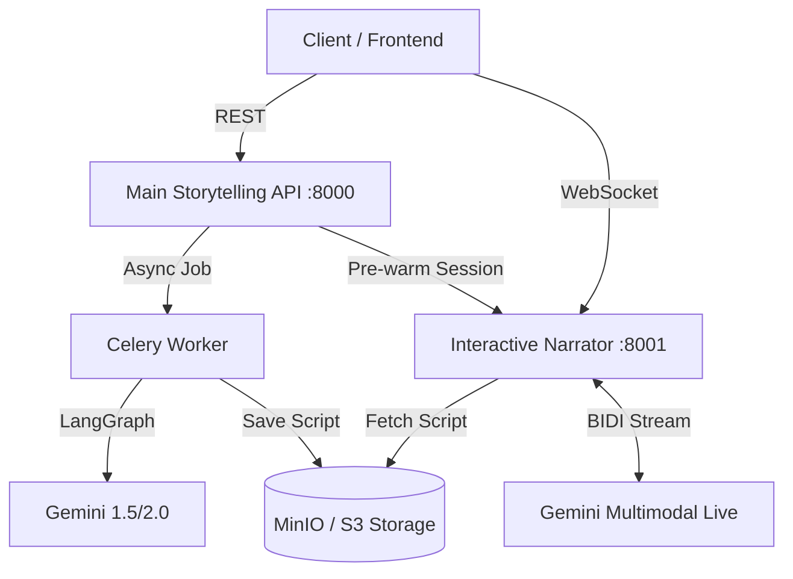

# AI Storytelling Backend Suite

> A production-grade, dual-service architecture for agentic story generation and real-time multimodal narration.

This repository contains the complete backend implementation for the Storytelling AI system. It is composed of two primary microservices that work in harmony to transform high-level topics into immersive, interactive audio experiences.

---

## 🏗️ System Architecture

The system is split into two specialized services to ensure scalability and separation of concerns:



### 1. Main Storytelling API (`/backend/main`)
The "Brain" of the system. It handles the narrative lifecycle:
*   **Planning**: Agentic drafting of story outlines with Human-in-the-Loop support.
*   **Generation**: Parallel chapter writing via a fan-out Celery worker pattern.
*   **Orchestration**: Managing the state machine (LangGraph) and external service hooks.
*   **Observability**: Real-time progress monitoring via Server-Sent Events (SSE).

### 2. Interactive Narrator Service (`/backend/tts`)
The "Voice" of the system. It handles real-time interactivity:
*   **Session Management**: Pre-warms narration scripts fetched directly from storage.
*   **BIDI Streaming**: Bi-directional WebSocket communication for low-latency audio.
*   **Multimodal Live**: Directly interfaces with Gemini's native audio capabilities for expressive, dynamic narration.

---

## 🛠️ Tech Stack

| Component | Technologies |
|---|---|
| **API Framework** |  |
| **Agentic Workflow** |  |
| **Logic & AI** |   |
| **Databases** |   |
| **Task Queue** |  |
| **Object Storage** |  |

---

## 🚀 Quick Start & Flow Verification

### 1. Docker (Recommended)
You can start the entire backend suite (Services + Infrastructure) with a single command from the `./backend` root:
```bash
docker-compose up -d --build
```
This will launch:
*   **Main API** (:8000)
*   **TTS Service** (:8001)
*   **Celery Worker** (Parallel Chapter Generation)
*   **Infrastructure**: Postgres, Redis, MinIO, and pgAdmin (:5050).

### 2. Manual Installation
If you prefer to run services locally (outside of Docker):
1.  **Infrastructure**: `docker-compose up -d postgres redis minio`
2.  **API Env**: `cd main && pip install -r requirements.txt && uvicorn api.main:app --reload --port 8000`
3.  **Worker Env**: `cd main && celery -A tasks.celery_app worker --loglevel=info`
4.  **TTS Env**: `cd tts && pip install -r requirements.txt && uvicorn main:app --reload --port 8001`

---

## 🎙️ End-to-End Testing Workflow

Follow this manual test flow to verify the entire "Generation -> Narration" pipeline:

### Phase A: Generation
Submit a new story request:
```bash
curl -X POST http://localhost:8000/stories/generate \
     -H "Content-Type: application/json" \
     -d '{"topic": "A city on the clouds", "tone": "inspirational"}'
```
*Note the `story_id` in the response.*

### Phase B: Monitor
Watch the agents work in real-time:
```bash
curl -N http://localhost:8000/stories/{STORY_ID}/events
```
*Wait for `"status": "completed"`.*

### Phase C: Narration
1. **Initialize Session**:
   ```bash
   curl -X POST http://localhost:8000/stories/{STORY_ID}/listen
   ```
   *Note the `session_id` and `user_id`.*

2. **Connect WebSocket**:
   Connect to `ws://localhost:8001/ws/{user_id}/{session_id}` and send:
   ```json
   { "type": "start_narration" }
   ```

---

*   **[Architecture In-Depth](file:///home/thiwa/Documents/projects/storytelling_ai/backend/doc/architecture.md)**: Deep-dive into service communication and layers.
*   **[Agent Flows](file:///home/thiwa/Documents/projects/storytelling_ai/backend/doc/agent_flow.md)**: Detailed LangGraph state machine and node specs.
*   **[Frontend Integration](file:///home/thiwa/Documents/projects/storytelling_ai/backend/doc/frontend_integration.md)**: Guide for UI synchronization and audio streaming.
*   **[UI/UX Design Brief](file:///home/thiwa/Documents/projects/storytelling_ai/backend/doc/ui_design_brief.md)**: Creative vision and component specs for designers.
*   **[Architecture Decisions (ADR)](file:///home/thiwa/Documents/projects/storytelling_ai/backend/doc/decisions.md)**: Rationale for technical choices.
*   **[Docker Orchestration](file:///home/thiwa/Documents/projects/storytelling_ai/backend/docker-compose.yml)**: Unified backend setup.

---

## 🛡️ Security & Reliability
*   **Repository Pattern**: Strictly decoupled data persistence from business logic.
*   **Global Exception Handling**: Secure, unified error responses across all endpoints.
*   **Session-Based Narration**: Stories are accessed via pre-authenticated `session_id` tokens.
*   **Type Safety**: Pydantic models used for all cross-service communication.
