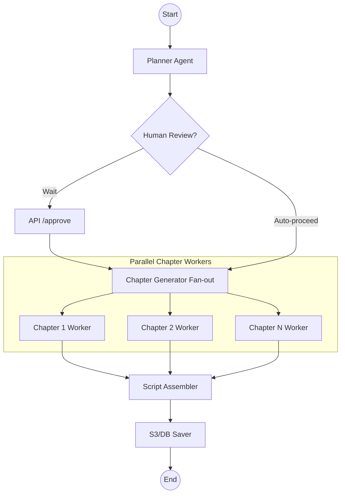

# Agentic Pipeline & State Machine

The core intelligence of the Storytelling AI is implemented as a **LangGraph State Machine**. This ensures that the long-running generation process is predictable, auditable, and capable of Human-in-the-Loop interaction.

---

## 📈 Pipeline Flow Visualization

---

## 🧠 Node Roles & Responsibilities

### 1. Planner Agent ([agents/planner.py](file:///home/thiwa/Documents/projects/storytelling_ai/backend/main/agents/planner.py))
*   **Goal**: Create a high-level narrative structure (Chapters & Sections).
*   **Input**: User topic, tone, and audience.
*   **Logic**: Uses Gemini to generate a JSON-structured outline.
*   **Output**: Updates `outline_json` in the story state.

### 2. Chapter Generator ([agents/generator.py](file:///home/thiwa/Documents/projects/storytelling_ai/backend/main/agents/generator.py))
*   **Goal**: Write the actual prose for a single chapter.
*   **Logic**: Parallelized via a fan-out pattern. Each worker receives the global outline and the context for its specific chapter. This ensures that while workers are parallel, they remain narratively consistent.
*   **Output**: Updates `chapters_content` (a list or dictionary of generated prose).

### 3. Script Assembler ([agents/assembler.py](file:///home/thiwa/Documents/projects/storytelling_ai/backend/main/agents/assembler.py))
*   **Goal**: Stitch the generated chapters into a cohesive script.
*   **Logic**: Performs final narrative formatting and smoothing of transitions between chapters.
*   **Output**: Updates `draft_script` (the final plain-text or studio-script narrative).

### 4. Saver Node ([agents/saver.py](file:///home/thiwa/Documents/projects/storytelling_ai/backend/main/agents/saver.py))
*   **Goal**: Persist the final state to infrastructure.
*   **Logic**: Uploads the `draft_script` to S3 as a `.txt` file and updates the story's status to `completed` in the database.
*   **Output**: Returns the `script_path` for use by the TTS service.

---

## 🛑 State Transitions & Interactivity

The cycle includes built-in "wait states" that allow for external intervention:
- **Outline Review**: The pipeline can be configured to stop after the `Planner` node. The `StoryService` exposes a `PATCH /stories/{id}/outline` endpoint to allow manual edits before the costly generation phase begins.
- **Approval Trigger**: The `POST /stories/{id}/approve` endpoint provides the "Go" signal that resumes the state machine from the `Planner` to the `Generator` phase.
