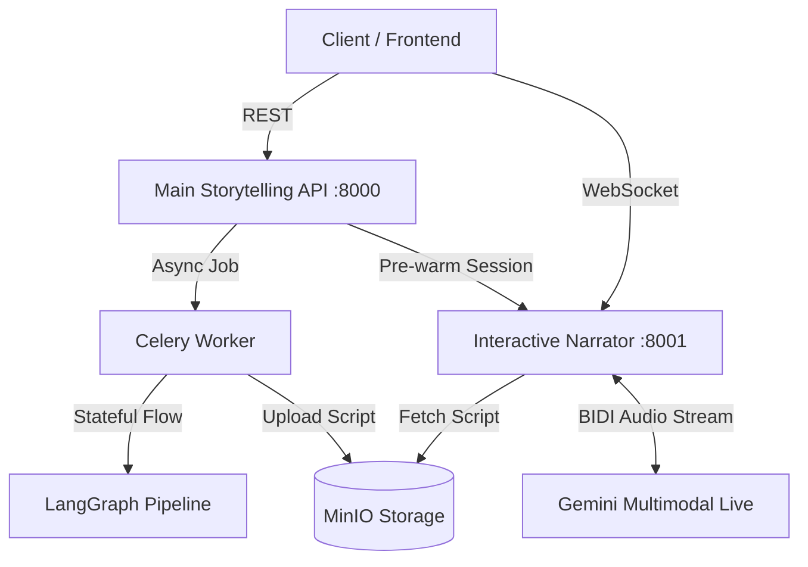

# System Architecture

The Storytelling AI system is a distributed backend suite designed for high-performance, parallelized story generation and low-latency, real-time narration. It follows **Clean Architecture** principles to ensure modularity and ease of maintenance.

---

## 🏗️ Multi-Service Design

The system is composed of two primary microservices that communicate asynchronously and through shared object storage (MinIO/S3).

### 1. Main Storytelling API (`/backend/main`)
The central orchestrator of the system.
*   **Transport Layer**: FastAPI routes focus on job submission, status monitoring, and job management.
*   **Domain Layer (Service)**: Orchestrates business logic, such as coordinating with Celery and the TTS service.
*   **Data Layer (Repository)**: Encapsulates all PostgreSQL logic for persistent state management.
*   **LangGraph Pipeline**: A stateful AI workflow that manages the planning, generation, and assembly nodes.

### 2. Interactive Narrator (`/backend/tts`)
A specialized service for low-latency, real-time audio interaction.
*   **Session-Based Life-cycle**: Narration sessions are "pre-warmed" by picking up the generated script from S3.
*   **WebSocket BIDI**: Handles bi-directional communication for real-time PCM audio streaming.
*   **Native Audio Support**: Interfaces with Gemini's Multimodal Live model for high-naturalness, expressive narration.

---

## 📂 Layered Breakdown (Main API)

The Main API follows a **Three-Tier Architecture**:

1.  **API Shell ([api/](file:///home/thiwa/Documents/projects/storytelling_ai/backend/main/api/))**:
    *   `main.py`: Route definitions and exception handlers.
    *   `dependencies.py`: FastAPI DI for services and repositories.
    *   `schemas.py`: Pydantic models for request/response validation.

2.  **Service Layer ([services/](file:///home/thiwa/Documents/projects/storytelling_ai/backend/main/services/))**:
    *   `story_service.py`: Centralized logic for starting generations, edits, and listener session orchestration.

3.  **Repository Layer ([repositories/](file:///home/thiwa/Documents/projects/storytelling_ai/backend/main/repositories/))**:
    *   `story_repo.py`: Atomic, persistent operations against the Storytelling database.

---

## 🛡️ Persistence & Shared Resources

*   **Database**: PostgreSQL stores all story metadata, drafts, and job status.
*   **Storage (S3)**: MinIO acts as a local, S3-compatible bucket for final scripts and (optionally) generated audio chunks.
*   **Message Broker**: Redis handles Celery task distribution and Pub/Sub for real-time Progress streaming (SSE).
